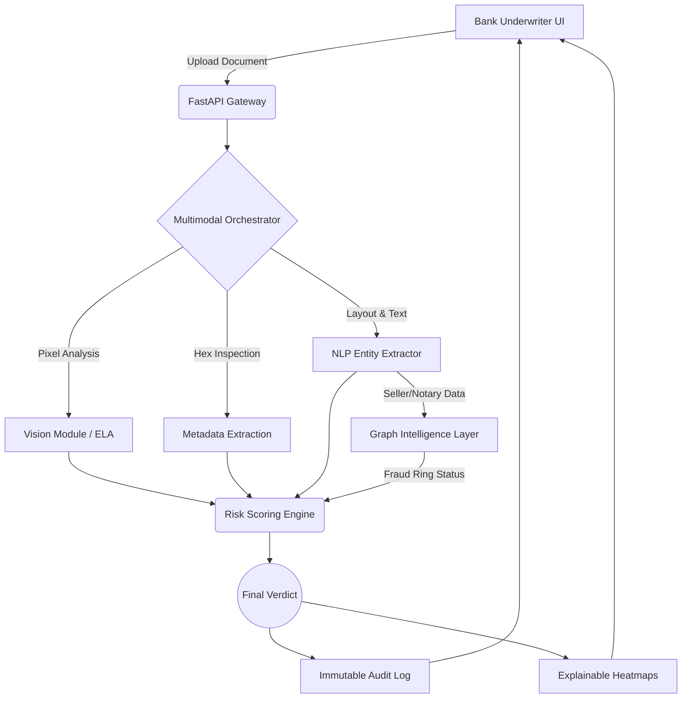

# Suraksha: Enterprise Document Fraud Detection Pipeline

  

## 📌 The Problem
Indian PSU and private banks face **₹1,000s of Crores** in bad loan write-offs annually due to sophisticated property title deed forgery. Current manual underwriting takes days and fails to detect pixel-level manipulation, metadata tampering, or coordinated shell corporation fraud rings.

## 🚀 The Solution: Suraksha Intelligence
Suraksha is an **investor-ready, bank-deployable SaaS pipeline** that completely eliminates title deed fraud. We orchestrate a multimodal AI pipeline consisting of Vision Transformers, NLP extractors, Error Level Analysis (ELA), and Graph Intelligence to evaluate documents with superhuman precision in under **2.5 seconds**.

---

## 🏆 Competitive Advantage & Technical Moat

Suraksha is not just a document parser; it is a **systemic fraud intelligence engine**.

1. **Multimodal Analysis:** We don't just read the text; we analyze the physical pixels of the image for Photoshop/GIMP compression artifacts (ELA).
2. **Graph Intelligence:** We dynamically build a Neo4j-style graph of buyers, sellers, and notaries to detect coordinated fraud rings and shell corporations.
3. **Immutable Audit Trails:** Built for RBI compliance and IT Act 2000 (Sec 65B), every AI decision is immutably logged.
4. **Active Learning (HITL):** Officer override systems allow underwriters to correct the AI, feeding a continuous data flywheel for model retraining.

---

## 🧠 System Architecture



---

## 💻 Technical Capabilities (Phase 1-6 Delivered)

- **Phase 1 (Ingestion):** PyMuPDF & Pillow based metadata extraction for forged EXIF data.
- **Phase 2 (Vision/NLP):** OpenCV Error Level Analysis. Generates pixel-level heatmaps highlighting exactly where text was spliced.
- **Phase 3 (Graph):** `react-force-graph-2d` visualization of fraud networks. Identifies repeat property abuse.
- **Phase 4 (Enterprise/Audit):** SQLite/PostgreSQL backed immutable audit trail with Officer Override (Active Learning). Dockerized microservices.
- **Phase 5 (Pitch/Business):** Executive Dashboards, Projected ROI calculation, AI validation benchmarks.
- **Phase 6 (Demo Safety):** "Zero-Crash" offline fallback systems, Guided Demo presentation modes.

---

## 🛠️ Local Installation & Setup

### Requirements
* Python 3.10+
* Node.js v20+
* Docker (optional for containerized deployment)

### 1. Backend (FastAPI + OpenCV)
```bash
cd backend
python -m venv venv
source venv/Scripts/activate  # On Windows
pip install -r requirements.txt
uvicorn app.main:app --reload
```
*Backend runs on http://localhost:8000*

### 2. Frontend (React + Vite + Tailwind V4)
```bash
cd frontend
npm install
npm run dev
```
*Frontend runs on http://localhost:5173*

### 3. Generate Demo Data (Crucial for Pitch)
To generate the necessary `clean`, `forged`, and `fraud ring` images for the one-click demo UI:
```bash
cd frontend/synthetic_engine
python generator.py
```

---

## 🐋 Docker Deployment (Production)

Suraksha is fully containerized and ready for cloud deployment (AWS ECS, Render, Railway).

**Backend Image:**
```bash
cd backend
docker build -t suraksha-backend .
docker run -p 8000:8000 suraksha-backend
```

**Frontend Image (Multi-stage NGINX build):**
```bash
cd frontend
docker build -t suraksha-frontend .
docker run -p 80:80 suraksha-frontend
```

---

## 📈 Demo Script / Presentation Guide

1. **Start on the "Business Value" Tab:** Hook the judges immediately with the ₹120 Crore savings estimate, SaaS scale capacity, and 98.5% validation accuracy.
2. **Switch to Dashboard:** Explain the simple, underwriter-friendly UI. 
3. **Execute "Fraud Ring" Live Demo:** Click the third demo scenario button. The system will process it instantly.
4. **Showcase Heatmap Explainability:** Draw attention to the purple Tamper Heatmap generated by the Vision layer.
5. **Switch to "Graph Intelligence" Tab:** Show the physics-based graph mapping out the coordinated shell corporations.
6. **Execute Officer Override:** Show the Human-In-The-Loop (HITL) capability.
7. **Switch to "Audit History":** Conclude by showing the immutable case history. Mention RBI compliance and IT Act defensibility.

---
*Built with ❤️ for Indian FinTech Security.*
